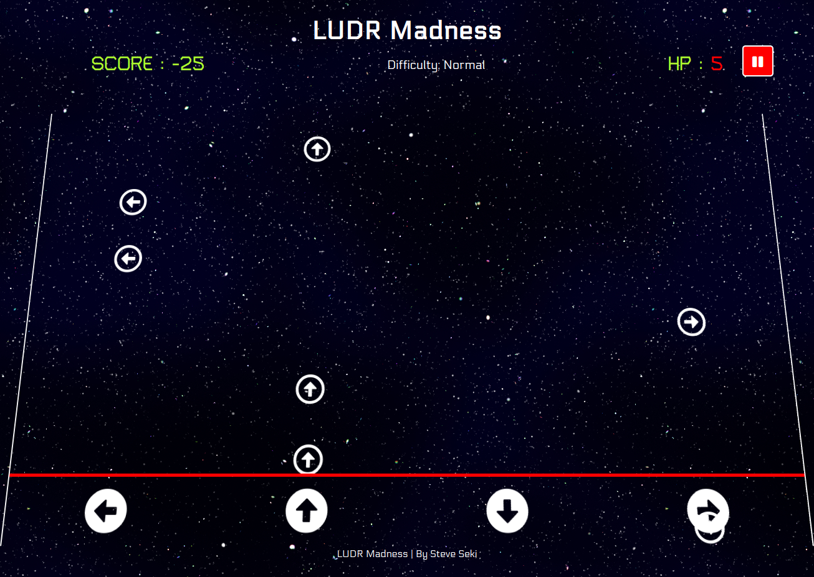

# LUDR Madness
## Juno College Project 3 - solo jQuery

## Live Link
http://tseki88.github.io/steveSekiProjectThree

known issues:
- firefox: setInterval time latency, sound effect may not trigger

## Project Proposal
### MVP
- 1 arrow object moving from top to bottom. 
- When the arrow falls into the acceptable range within a "hit" box, press the associated arrow key on keyboard (or click / tap on hitrange container) to evaluate. 
- Score counter to increase when hit made.

### Stretch Goal:
- [x] Score counter decrease on miss
- [x] More than 1 arrow at a time.
- [x] Increase to 4 columns(each with their own arrow - up down left right)
- [x] animation to show that an event handler took place
- [x] Space button to "pause" the game
- [x] Start Menu - start with interval not set.
- [x] Workaround for mobile (touchstart and click register as 2 events at the moment, resulting in -2 points when clicked too early)
- [x] button for pause
- [x] Win / GameOver conditions..?
- [x] make sure to init() / document ready
- [x] Add sound for when eventlistener triggers ? hit : miss;
- [x] Difficulty Levels(rate increase for speed, # of arrows appended)
- [x] Leaderboard function utilizing firebase
- [ ] Combo multiplier
- [ ] Zen Mode (Endless)

### Pseudocode

#### Objects involved: 
- Parent Container
- Arrow
- "hit" range container
- score counter

1. Find and select the parent container
    - then append Arrow (div with class .arrow) at top of page.
    - Arrow will be position absolute
    - Arrow will have a top value set. (aka Y-axis coordinates).

2. Make function which shifts the Arrow down:
    - decrease the Y-axis coordinate values which loop at a set interval (to be determined).

3. Make the following event handlers: 
    - "down arrow" key is pressed on the keyboard
    - mouseclick on hitrange container
    - screentap on hitrange container(mobile)

4. All 3 event handlers will:
    - verify if the y-axis of the Arrow is within the "acceptable range (to be determined)" inside the hitrange container.

5. If the arrow is within the hit range
    - make the arrow disappear & increase score counter value by 1 and update score display.
        - else -> arrow will continue to shift downwards.

6. If arrow falls off page, remove arrow.

7. repeat append Arrow "X" times (tbd);

### Sound File Credits:

#### Michel Baradari - https://opengameart.org/content/9-sci-fi-computer-sounds-and-beeps
- tick.wav
- flagdrop.wav
- resume.wav
#### Space shooter sound fx pack 1 by Dravenx - https://opengameart.org/content/space-shooter-sound-effects
- hit.wav
- miss.wav
- gameover.wav
- pause.wav